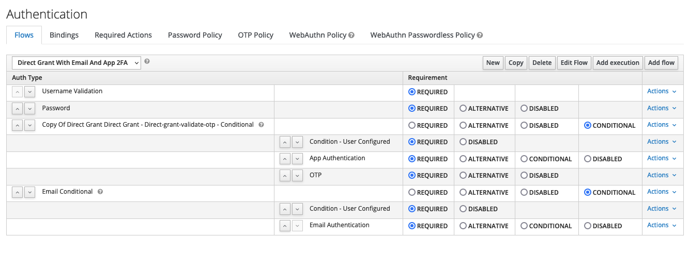
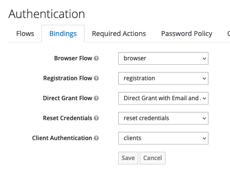
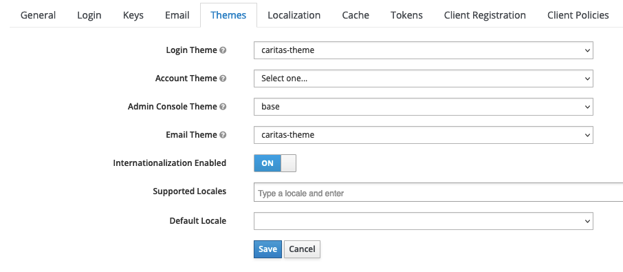

# onlineberatung-keycloak-otp

Adds additional endpoints to keycloak to configure 2FA. Currently supports 2FA via:

* App (e.g. Google Authenticator)
* Email

## Installation

* Create a jar (e.g. mvn package)
* Copy `keycloak-otp-config-spi-<VERSION>-keycloak.jar` into the keycloak deployments folder.
  E.g. `/opt/jboss/keycloak/standalone/deployments`, or with 17+ version into `/opt/keycloak/providers`.
* Keycloak will pick up the deployment. If it is deployed successfully, a `.deployed` file will
  appear in the deployments folder with the same name as the jar.
  E.g. `keycloak-otp-config-spi-<VERSION>-keycloak.jar.deployed` (versions below 17). With version 17+ a server build and restart is necessary.
* Configure Authentication flow for direct grant.
* Copy your email theme into themes folder, e.g. `/opt/keycloak/themes/your-theme`. Should contain `otp-email.ftl`.
* Configure email theme for realm.

## Configuration

An authentication flow has to be configured in the Keycloak Admin Console at the Authentication
configuration. We cannot edit the default flows but have to create a copy of an existing flow (e.g.
Direct Grant). Both authenticators in this jar handle Direct Grant flow only. They operate the
following way:

* The current app authenticator just checks if an otp param exists in the request. If it exists, the
  request is forwarded to the default keycloak otp authenticator. The default authenticator handles
  the validation. If no otp param is present, the authenticator sends a request back to frontend
  and the user is prompted to enter their otp.
* The mail authenticator also checks for an otp param, but in addition handles verification if
  it is present.

After flow configuration, we have to bind our custom flow to the Direct Grant flow of Keycloak in
the Bindings tab:

Finally, configure the email theme in your Realm Settings:

